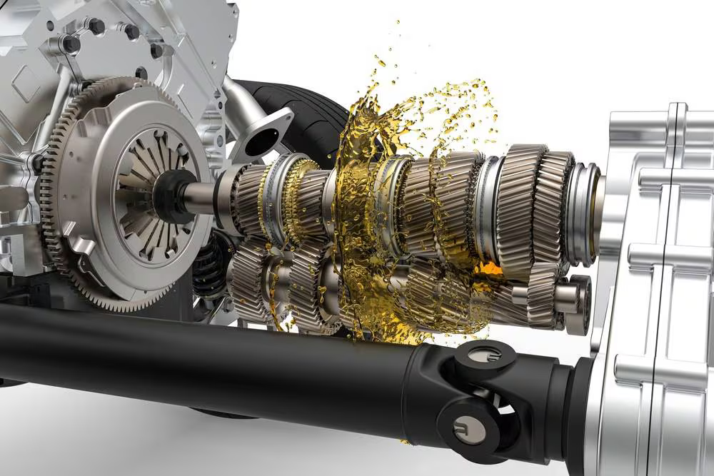
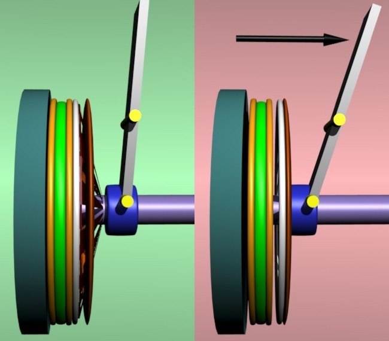
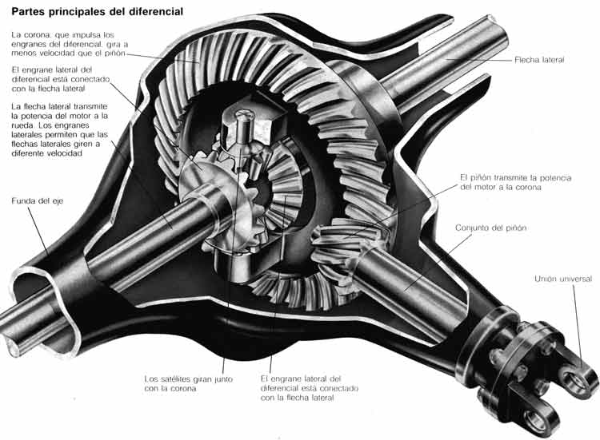
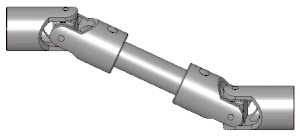

# La transmisión de un automóvil
### ¿Qué es la transmisión de un auto?
#### La transmisión es un sistema mecánico que se encarga de transmitir la potencia del motor a las ruedas del vehículo. Es un componente fundamental que permite al conductor controlar la velocidad y el par motor del vehículo.
### Tipos de transmisiones
- Transmisión manual 
- Transmisión automática (continuamente variable)
- Transmisión automática (de doble embrague)
### Componentes principales de la transmisión
- Caja de Cambios

- Embrague

- Diferencial

- Eje de transmisión
