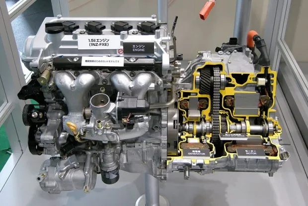

# Motores
## Que es un motor
### Es la fuente de energía mecánica imprescindible en el vehículo para poder moverse, sin el motor no hay movimiento. Es al coche como el corazón al ser humano. El motor transforma la energía de combustión interna, la eléctrica o la combinación de ambas en energía que permite generar un continuo impulso mecánico cuya fuerza hace girar las ruedas para que el coche pueda desplazarse

## Tipos de motores
- Motores de combustion interna

- Motores electricos

- Motores hibridos

## Elementos del motor
- Cilindros
https://es.wikipedia.org/wiki/Cilindro_(motor)
- Pistones
https://es.wikipedia.org/wiki/Pist%C3%B3n
- Valvulas
https://alcazabamotor.es/blog/2020/03/06/que-son-las-valvulas-del-motor-y-para-que-sirven/#:~:text=Las%20v%C3%A1lvulas%20del%20motor%20son,plana%20(plato%20o%20cabeza)
- Bielas
https://www.motor.es/que-es/biela
- Culata
https://es.wikipedia.org/wiki/Culata_(motor)
